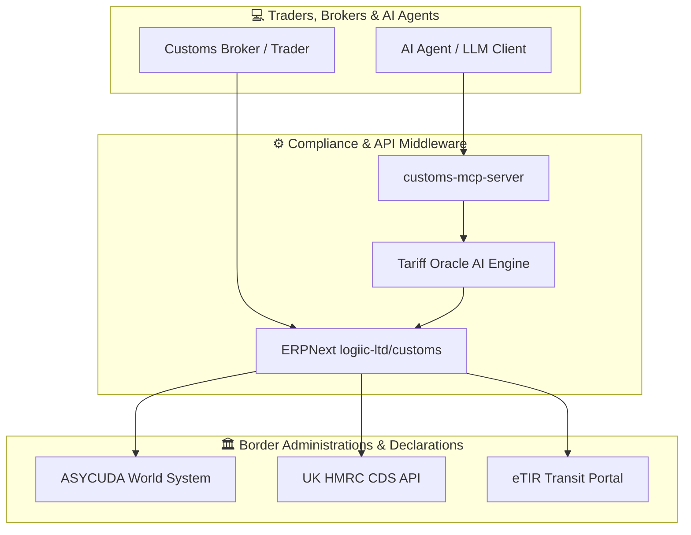

# 🛃 Awesome Customs Management

  

  
  
  
  
  
  
  

## 🌐 Overview & Top Customs Management Platforms Ecosystem

A curated list of **SaaS platforms**, **AI trade compliance tools**, and **open-source GitHub projects** for **Customs Management**, **Automated Broker Interface (ABI)**, **Tariff Classification (HTS/HS Codes)**, **Sanctions Screening**, and **Cargo Clearance**.

Whether you are a customs broker, freight forwarder, trade compliance manager, or government customs administration, this repository provides comprehensive insights into global trade execution software.

**Last updated: September 2026** 📅

---

## 📊 Customs & Global Trade Management SaaS Ecosystem

### 📈 Market Size & Structure
> 💡 **Market Size & Structure**: The Global Trade Management (GTM) and Customs Management Software sector is estimated at **$2.8 Billion - $3.5 Billion** and is projected to reach over **$6.2 Billion by 2030** (CAGR ~9.8%). The enterprise market is **moderately to highly concentrated** around major logistics tech conglomerates (WiseTech Global, Descartes, Thomson Reuters, E2open), while remaining **fragmented** in regional customs brokerage software for specific country borders.

### 🏢 SaaS & Enterprise Platforms Overview

| Company / Product | Size / Valuation / Revenue 🏢 | Specific Starting Pricing Tier 💰 | Free Tier / Free Trial Limits 🎁 | Key Features & Capabilities 🚀 |
| :--- | :--- | :--- | :--- | :--- |
| **[Thomson Reuters ONESOURCE](https://tax.thomsonreuters.com/)** | **~$42.0B Market Cap** ($7.83B Annual Revenue) | **Starting ~$15,000/yr** (Enterprise custom tier quotes) | **No Free Tier / No Free Trial** (Guided product demo on request) | Global tax, customs duty calculation, tariff classification, free trade agreement (FTA) management, and multi-country compliance. |
| **[WiseTech CargoWise](https://www.cargowise.com/)** | **~$7.7B Market Cap** ($1.396B Annual Revenue) | **~$9.95 per standalone customs entry** / ~$19.95 per import container (CargoWise Value Pack) | **No Free Tier / No Free Trial** (Request-based enterprise sandbox demo with account representative) | Enterprise freight forwarding, multi-jurisdiction customs declaration, automated ABI clearance, and logistics execution across 160+ countries. |
| **[Descartes Systems Group](https://www.descartes.com/)** | **~$6.7B Market Cap** ($750M Annual Revenue) | **Starting ~$500/mo** (Standard custom module tier quotes) | **No Free Tier / No Free Trial** (Consultative demo & solution assessment) | Global trade intelligence, duty calculation, denied party screening, entry summary automation, and logistics networking. |
| **[Livingston International](https://www.livingstonintl.com/)** | **~$1.25B Est. Revenue** (Private Subsidiary of Purolator) | **Starting ~$75 - $150 per clearance file** (Custom brokerage transaction rates) | **No Free Tier / No Free Trial** (Free online preliminary duty calculator & quote consultation) | Canadian & US customs brokerage, duty relief programs, global trade management, and trade compliance consulting. |
| **[E2open Customs Management](https://www.e2open.com/)** | **~$1.04B Market Cap** ($600M Annual Revenue) | **Starting ~$549/yr** (Basic carrier/entry tier) to custom enterprise suites | **No Free Tier / No Free Trial** (Custom live platform demo) | End-to-end supply chain visibility, export compliance, import/export declarations, and multi-country regulatory management. |
| **[Magaya Customs](https://www.magaya.com/)** | **~$50M - $100M Est. Revenue** (Private Equity backed) | **Starting ~$300/user/month** (Customs & ABI add-on module quote) | **No Free Tier / No Free Trial** (Personalized live software demo) | ACE-certified ABI filing for freight forwarders and customs brokers, Broker AI Assistant for invoice parsing, and automated HTS recommendations. |
| **[Precision Software (QAD Precision)](https://www.ptc.com/)** | **QAD Division** (Acquired by Thoma Bravo) | **Starting ~$1,000/mo** (Enterprise supply chain module quote) | **No Free Tier / No Free Trial** (Custom demo) | Parcel & LTL shipping, global trade compliance, restricted party screening, and customs clearance integration. |
| **[Microlistics WMS & Customs](https://www.microlistics.com/)** | **WiseTech Subsidiary** | **Starting ~$1,200/mo** (Regional WMS/Customs package quote) | **No Free Tier / No Free Trial** (Guided product demo) | Warehouse management and regional customs entry processing for ANZ and Asia-Pacific markets. |
| **[CustomsNow](https://www.customsnow.com/)** | **Private Independent** | **Starting ~$250/mo** (Entry-level broker/importer tier quote) | **No Free Tier / 14-Day Free Trial** available upon account verification | Direct US ACE ABI filing, automated reconciliation, entry summary processing, and importer self-filing software. |

---

## 💻 Open-Source GitHub Projects

Open-source customs solutions play a pivotal role in national customs administrations, government trade transit systems, AI-driven commodity classification, and developer toolkits.

### 🌟 Open-Source Repositories (Sorted by Stars_Count)

| Repository / Project 📦 | Stars_Count ⭐️ | Primary Stack 🛠️ | Category 🏷️ | Key Features ⚡ |
| :--- | :--- | :--- | :--- | :--- |
| **[datasets/harmonized-system](https://github.com/datasets/harmonized-system)** |  | JSON, Data Package | Tariff Data | Official WCO Harmonized System (HS) codes structured into clean data packages for trade software integration. |
| **[mwouts/world_trade_data](https://github.com/mwouts/world_trade_data)** |  | Python, Pandas | Trade Analytics | Python interface for World Integrated Trade Solution (WITS) API, enabling direct extraction of tariff and trade statistics. |
| **[eTIR National Application (UNECE)](https://github.com/etir-org)** |  | Spring Boot, React, PostgreSQL | Transit System | UNECE open-source reference implementation for electronic TIR international transit procedures. |
| **[logiic-ltd/customs](https://github.com/logiic-ltd/customs)** |  | Python, Frappe, ERPNext | Declaration Engine | Configurable customs declaration module for ERPNext, handling SAD, manifests, waybills, and automated tax assessment. |
| **[HMRC customs-declarations](https://github.com/hmrc/customs-declarations)** |  | Scala, MongoDB, Play | Government API | UK HMRC open-source API processing declarations in accordance with WCO DMS 3.6 schemas. |
| **[RumetoBr/tariff-oracle](https://github.com/RumetoBr/tariff-oracle)** |  | Python, Docker | AI Classification | AI-powered autonomous HTS classification and duty calculation engine supporting 217 jurisdictions with reasoning explanations. |
| **[HMRC customs-movements-frontend](https://github.com/hmrc/customs-movements-frontend)** |  | Scala, Play Framework | Frontend UI | UK HMRC export movements frontend for managing export declaration consolidations and departure notifications. |
| **[devandop/global-trade-compliance-ai-assistance](https://github.com/devandop/global-trade-compliance-ai-assistance)** |  | FastAPI, Gemini LLM, Slack | AI Compliance | Conversational AI interface for automated HS classification, sanctions screening, and Slack approval workflows. |
| **[yak33/customs-mcp-server](https://github.com/yak33/customs-mcp-server)** |  | TypeScript, Node.js | MCP AI Tool | Model Context Protocol (MCP) server providing 14 customs tools for Claude, Cursor, and Windsurf AI agents. |
| **[kkzakaria/pdf-xml-asycuda](https://github.com/kkzakaria/pdf-xml-asycuda)** |  | Python, FastAPI, Docker | Data Converter | Converts PDF import verification certificates (RFCV) into ASYCUDA-compatible XML format. |
| **[Budget-Lab-Yale/tariff-impact-tracker](https://github.com/Budget-Lab-Yale/tariff-impact-tracker)** |  | Python, R, Stata | Tariff Tracker | Yale Budget Lab open-source data pipeline tracking effective tariff rates (ETRs) using USITC datasets. |
| **[ASYCUDA (UNCTAD World Systems)](https://asycuda.org/)** |  | Java, Quarkus, VueJS | Government Core | UNCTAD's flagship customs management software deployed in **100+ countries**. (Source available to member nations). |

---

## 🛠️ Architecture & System Integration Blueprint

---

## 🤝 How to Contribute

Contributions are welcome! Please follow these simple steps to add new tools or update existing entries:

1. 🍴 **Fork** this repository.
2. 📝 **Edit `README.md`** adding your SaaS or Open-Source tool with factual descriptions.
3. 🧪 Ensure links and formatted columns (Pricing, Stars_Counts) adhere to existing table schemas.
4. 🚀 **Submit a Pull Request (PR)** with a clear title.

---

## 📜 Disclaimer

* This repository is a **community-curated directory** for educational and reference purposes.
* Customs regulations, tariff rates, and software licensing conditions vary by country. Always verify compliance with national customs authorities (US CBP, UK HMRC, EU DG TAXUD, UNCTAD WCO standards).

---

## 💖 Support & Community

If you find this repository helpful, consider supporting the project! 🌟

- ⭐ **Star** this repository on GitHub.
- 🔄 **Fork** and share it with trade compliance and logistics teams.
- 💬 Join our community on [Discord](https://discord.gg/jc4xtF58Ve).
- ☕ **Sponsor / Buy me a coffee**: Support ongoing open-source curation on the [Sponsor Dashboard](https://github.com/sponsors/ishandutta2007).

---

## 📈 Star History

---

  Made with ❤️ for customs brokers, trade compliance managers, import/export operations teams, and government customs administrations.

